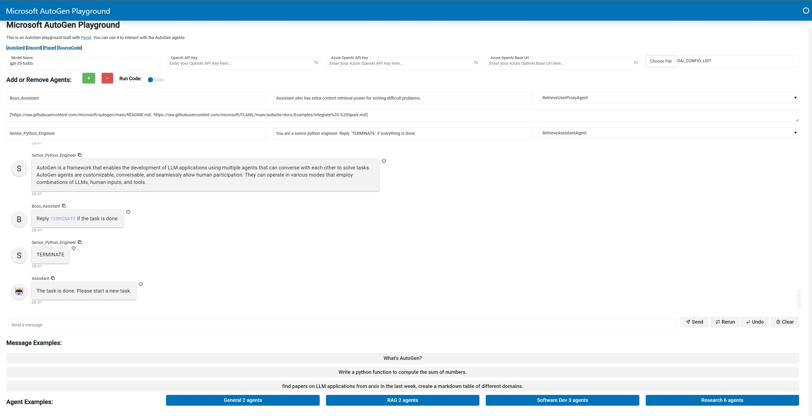
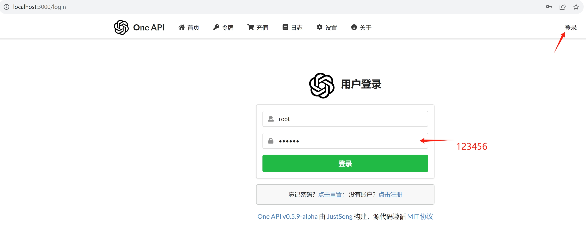
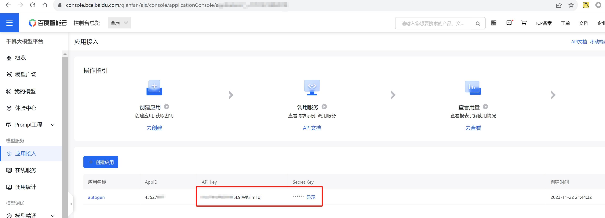
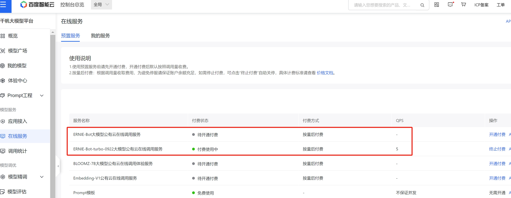
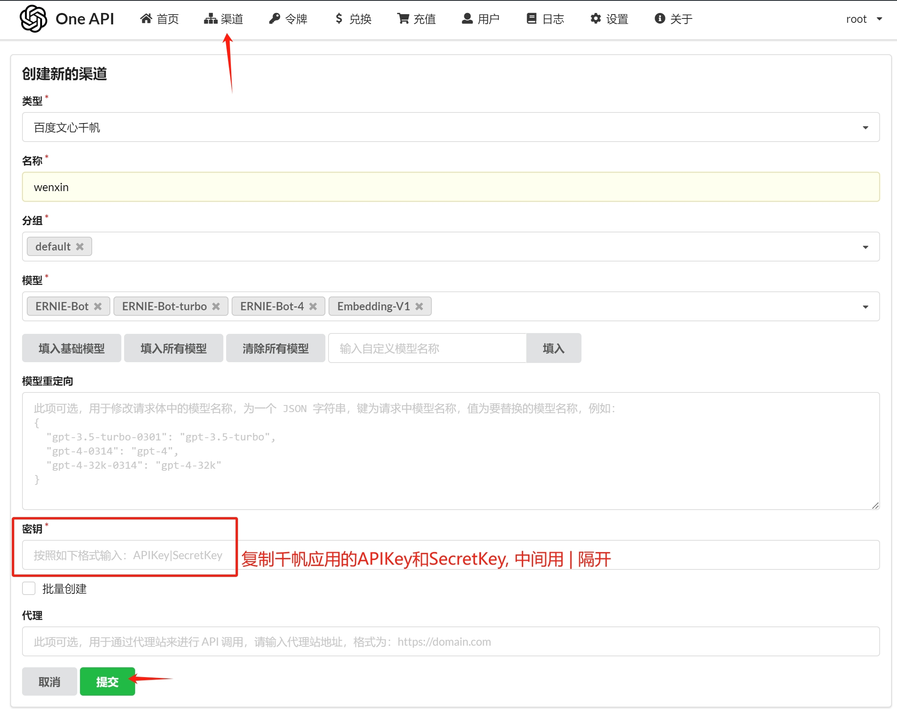
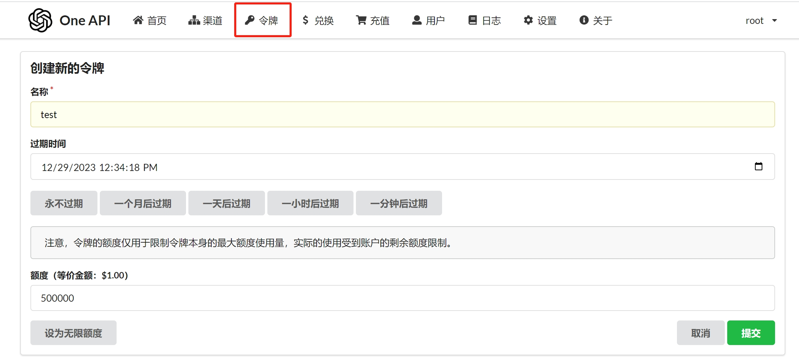
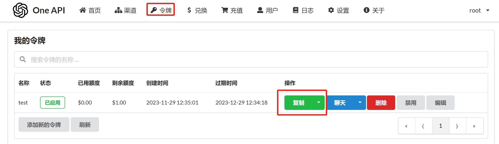
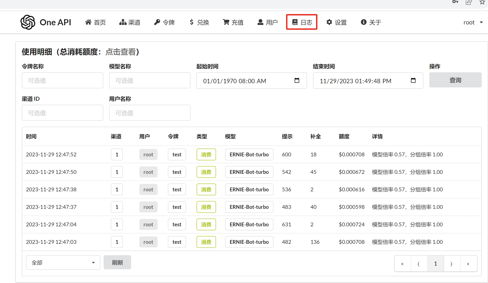

# Microsoft AutoGen Group Chat PlayGround

This demo is an AutoGen group chat playground built with [Panel](https://panel.holoviz.org/). You can use it to interact with the AutoGen agents. Scroll down to see the code for creating and using the agents.

## Run app
```
# Install dependencies
pip install -U -r requirements.txt

# Launch app
bash run.sh
```

## Run docker locally
```
docker build -t autogen/groupchat .
docker run -it autogen/groupchat -p 5006:5006
```

#### [AutoGen](https://github.com/microsoft/autogen) [SourceCode](https://github.com/thinkall/autogen-demos)



## Use ERNIE-Bot as LLM backend

1. Run [One-API](https://github.com/songquanpeng/one-api) locally
```bash
docker run --name one-api -d --restart always -p 3000:3000 -e TZ=Asia/Shanghai -v /home/ubuntu/data/one-api:/tmp justsong/one-api
```

2. Login with root user


3. Set up qianfan service



4. Wrap ERNIE-Bot into a local service


5. Create an openai style token



6. Create a file named `OAI_CONFIG_LIST` with below content

Put the file in the same folder with `app.py` then it will be loaded by default.

Or you can upload it in the app's UI later.
```
[
    {
        "model": "ERNIE-Bot-turbo",
        "base_url": "http://localhost:3000/v1/",
        "api_version": "2023-05-15",
        "api_key": "sk-***"
    }
]
```
Replace the model with the one you want to try, replace the api_key with the one you copied in step 5.

*Don't worry about the keys, everything is running locally.*

7. Chat with ERNIE-Bot


8. Check the usage log

