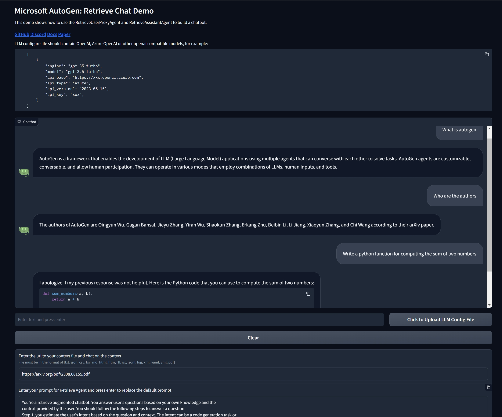

# Microsoft AutoGen: Retrieve Chat Demo

This demo shows how to use the RetrieveUserProxyAgent and RetrieveAssistantAgent to build a chatbot.

#### [GitHub](https://github.com/microsoft/autogen) [Discord](https://discord.gg/pAbnFJrkgZ) [Docs](https://microsoft.github.io/autogen/) [Paper](https://arxiv.org/abs/2308.08155)

LLM configure file should contain OpenAI, Azure OpenAI or other openai compatible models, for example:
```
    [
        {
            "engine": "gpt-35-turbo", 
            "model": "gpt-3.5-turbo",
            "api_base": "https://xxx.openai.azure.com", 
            "api_type": "azure", 
            "api_version": "2023-05-15", 
            "api_key": "xxx",
        }
    ]
```

